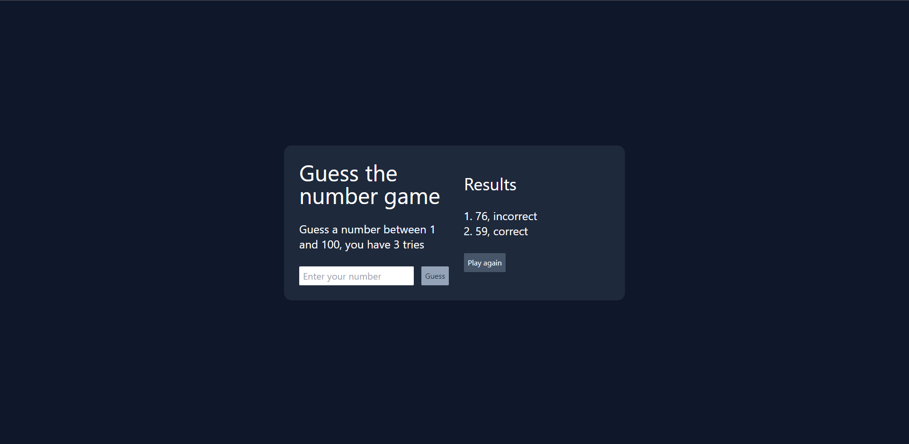

# Guess the Number Game

Welcome to the "Guess the Number" game!



## About the Game

This is a simple number guessing game where the player is asked to guess a number between 1 and 100. The player has 3 attempts to guess the correct number. After each guess, the game will provide feedback on whether the guess was correct.

## How to Play

1. Enter your guess in the input field.
2. Click the "Guess" button to submit your guess.
3. You will receive feedback on your guess.
4. Keep guessing until you either guess the correct number or run out of attempts.

## Features

- Randomly generated number for each game.
- Limited attempts (3 tries).
- Feedback on each guess.
- Option to play again after completing the game.

## Technologies Used

- React
- TypeScript
- CSS (SCSS)
- Tailwind CSS

## Getting Started

1. Clone this repository:

```bash
git clone https://github.com/your-username/guess-the-number.git
```

2. Change into the project directory:

```bash
cd guess-the-number
```

3. Install dependencies:

```bash
npm install
```

4. Start the development server:

```bash
npm run dev
```

5. Open your browser and visit http://localhost:3000 to play the game.

## License

This project is open-source and available under the MIT License.

## Author

M. _LoZoCz_ Czernik

GitHub: [LoZoCz](https://github.com/LoZoCz)

### Feel free to contribute to this project or report any issues. Enjoy the game!
